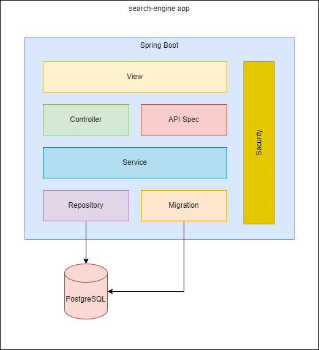

# search-engine

## Навигация

- [Бизнес требования](#Бизнес-требования)
- [Архитектура приложения](#Архитектура-приложения)
    - [Пояснительная записка](#Пояснительная-записка)
- [Навигация по проекту](#Навигация-по-проекту)
- [Обзор технологий](#Обзор-технологий)
- [Точки доступа](#Точки-доступа)
- [Как запустить](#Как-запустить)
  - [Запуск приложения](#Запуск-приложения)
  - [Создание БД в Docker](#Создание-БД-в-Docker)

## Бизнес требования

[Дипломный проект. Разработка поискового движка.pdf](https://github.com/Goganesh/searchEngine/blob/master/docs/%D0%94%D0%B8%D0%BF%D0%BB%D0%BE%D0%BC%D0%BD%D1%8B%D0%B9%20%D0%BF%D1%80%D0%BE%D0%B5%D0%BA%D1%82.%20%D0%A0%D0%B0%D0%B7%D1%80%D0%B0%D0%B1%D0%BE%D1%82%D0%BA%D0%B0%20%D0%BF%D0%BE%D0%B8%D1%81%D0%BA%D0%BE%D0%B2%D0%BE%D0%B3%D0%BE%20%D0%B4%D0%B2%D0%B8%D0%B6%D0%BA%D0%B0.pdf)

Приложение выполняет следующие бизнес-функции:
- панель администратора:
    - запуск индексации - все сайты;
    - запуск индексации - страница сайта;
    - остановка индексации;
    - просмотр текущей статистики по сайтам;
    - поисковый запрос;
    
## Архитектура приложения

### Пояснительная записка
Приложение написано с использованием Spring-Boot фреймворка и состоит из следующих слоев:
- View - слой отвечающий за отображение web-страниц в браузере. Слой состоит из статических HTML файлов и клиентской
  логики написанной с использованием Java Script. В качестве web-сервера выступает само приложение,
  которое раздает статику с помощью Spring MVC
- Controller - слой отвечает за принятие REST запросов из браузера клиента и передаче управления слою Service.
- API Spec - описание API выполняется по спецификации openapi.
- Service - слой обработки бизнес-логики.
- Repository - слой доступа к базе данных.
- Migration - миграция данных выполняется средствами Liquibase.
- Security - отдельная сущность, которая может быть применена к любому слою, ответственность - обеспечение безопасности.

В качестве базы данных используется PostgreSQl.

## Навигация по проекту

- controller - пакет, в котором находятся классы, отвечающие за обработку REST запросов
- domain - пакет с сущностями, которые проецируют реляционную структуру таблиц в нашей базе данных на объектно-ориентированные Java-классы
- exception - пакет с бизнес-исключениями, которые могут быть выброшены из нашего прикладного кода
- dto - пакет с классами для отображения данных на фронте
- repository - пакет с DAO слоем
- configuration - пакет с конфигурацией (java based) приложения: Spring Security, Spring MVC
- service - пакет с классами, имплементирующими бизнес-логику
- resources
  - static - директория со статическими файлами: css, js, fonts, img
  - templates - директория с HTML шаблонами
  - application.yaml - конфигурация приложения
  - db - директория для хранения логов Liquibase

## Обзор технологий
- Frontend:
  - HTML
  - CSS
  - Java Script
- Backend:
  - Java 11
  - Spring Boot:
    - Spring MVC
    - Spring Data JPA
    - Spring Security
- Database:
  - PostgreSQL
  - Liquibase
- DevOps
  - Maven
  - Swagger

## Точки доступа

### Адреса и порты
| Функция                        | Адрес          |                  
|:-------------------------------|:---------------|
|   Точка доступа к приложению   | localhost:8080 | 
|   Точка доступа к Swagger   | localhost:8080/api/swagger-ui.html | 

### Учетные записи
| Логин       | Пароль   | Роль      |                  
|:------------|:---------|:----------|
|  admin      | admin    |  ADMIN    |

## Как запустить

### Запуск приложения

Для сборки и запуска приложения вам понадобиться:
- JDK 11
- Maven

Команды ниже нужно выполнять в корневой директории с проектом.

Для сборки:
`mvn clean install`

Для запуска:
`java -jar target/search-engine-1.0.0.jar`

Для пользователей Windows может быть полезен git-bash, который является частью утилиты git [Скачать тут](https://git-scm.com/downloads)

### Создание БД в Docker

1. Загрузка image БД PostgreSQL
`docker pull postgres`
2. Запуск контейнера `docker run --rm --name=myContainer --env="POSTGRES_PASSWORD=postgres1" --publish 5432:5432 -d postgres`
3. Вызов контейнера `docker exec -it myContainer bash`
4. Переключение на пользователя `su postgres`
5. Вызов консоли `psql`
6. Создание базы данных для приложения `CREATE DATABASE search_engine`